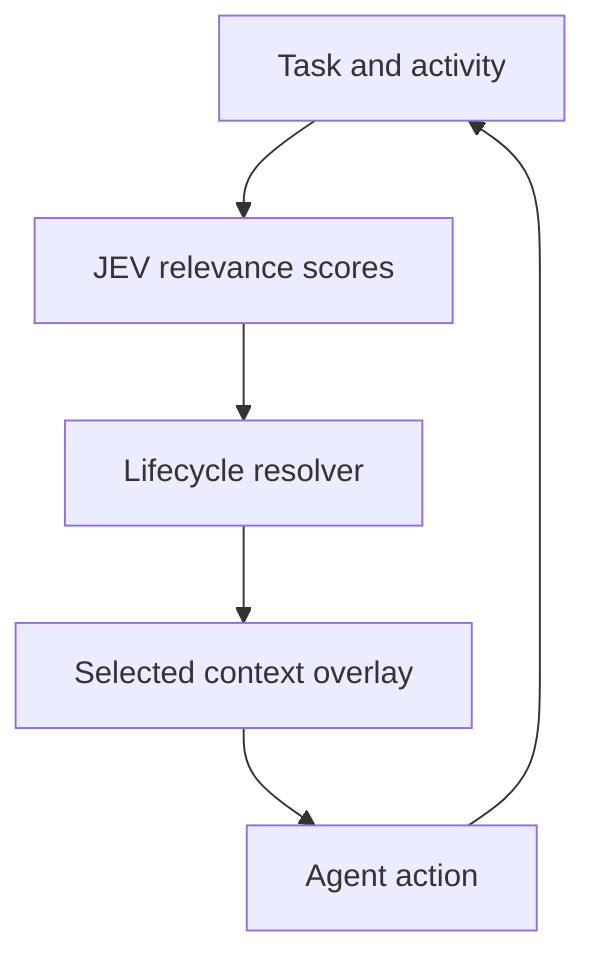

# BetterContext

**Progressive context for coding agents using TypeSafe/JEV System One and Microsoft APM.**

BetterContext is a proof of concept for giving an agent the rules and skills it needs for its current work. A controller selects resources from an APM catalog, adds their bodies to the agent's context, and removes them when they are no longer relevant. The goal is to reduce context pressure while preserving task correctness.

## Why it exists

Agent projects accumulate instructions, rules, and skills. Loading the entire catalog ensures availability, but spends context on resources unrelated to the current task. BetterContext manages context over time: it **materializes** relevant resources into the next prompt and **dematerializes** resources that should no longer be sent.

The controller owns the catalog. In isolated JEV evaluations, the agent workspace has no `apm.yml`, `.apm/`, `.agents/rules/`, or `.agents/skills/`; the agent receives only selected resource bodies.

## Headline result

The primary held-out comparison uses 10 unseen probes, a 94-resource catalog of approximately 46.7k tokens, the same agent model across arms, provider-backed JEV routing, and isolated workspaces.

| Context strategy | Retrieval | Recall | Critical misses | Average supplied context | Session tokens |
|---|---:|---:|---:|---:|---:|
| Load everything | 10/10 | 1.0 | 0 | 46,736 | 633k |
| Native APM discovery | 10/10 | 1.0 | 0 | traced¹ | 1.37M |
| **JEV progressive context** | **10/10** | **1.0** | **0** | **3,906** | **257k** |

In this run, progressive context matched both baselines on retrieval while supplying about **8% of the full catalog context** on average. Whole-session token usage was approximately **59% lower than load-all**. A second paired run also reached 10/10 retrieval, with 4,367 average context tokens.

¹ Native discovery is traced through opened files and input tokens; it does not have a fixed injected-context size.

See the [primary result](evals/progressive-context/results/probe-2026-09-22T17-31-31-8wmokx.json), its [grades](evals/progressive-context/results/probe-2026-09-22T17-31-31-8wmokx.json.grades.json), and the [replication](evals/progressive-context/results/probe-2026-09-22T19-35-27-9ufpxd.json). The [evidence record](evals/progressive-context/results/EVIDENCE.md) explains the metrics and other runs.

## How it works

Each agent turn follows a loop:

1. **Observe:** collect the goal, phase, current event, recent activity, changed paths, and active resources.
2. **Route:** send one batched System One request to score rules and shortlist skills for the current state.
3. **Resolve:** use deterministic thresholds, hysteresis, dependencies, lifetimes, and probation to activate, retain, or dematerialize resources.
4. **Compile:** put only the currently selected bodies in a single `<jev-apm-context>` overlay.
5. **Act:** give the agent the updated context; its actions inform the next routing decision.



A resource can become relevant, remain active across turns, and later leave the context. The resolver also requires weakly supported activations to gain confirmation from file or tool activity; otherwise their probation expires.

The [router](packages/progressive-context/src/router.ts), [resolver](packages/progressive-context/src/resolver.ts), and [compiler](packages/progressive-context/src/compiler.ts) implement these stages.

## What the evaluations measure

**Routing and isolation.** The held-out probes check whether the agent receives and cites the relevant resources while non-selected APM resources remain unavailable in its workspace. This is the headline benchmark above.

**Future-request unload.** Removing a resource from an active list does not establish that its text has left a continued conversation. The separate `ExplicitHarness` path rebuilds provider requests and checks that dematerialized bodies are absent from future requests. Reference run `live-2026-09-21T21-11-07` passed 4/4 unload proofs with zero sentinel leakage. This is a separate guarantee from the primary probe result.

**Coding-task correctness.** Live exercises test whether the agent builds working features while following the selected rules. In a paired two-phase refunds → notifications run, both JEV progressive context and native discovery passed 8/8 checks. JEV used 2.29M session tokens versus 3.10M for discovery, approximately **26% fewer** in that run. The checks cover feature behavior, payment boundaries, sensitive data, secret handling, notification fallback and retry, and tests.

Earlier runs include failures. One per-turn version let conversational activity activate more rules without corresponding implementation evidence. The context set grew and the agent did not finish the first phase. Probation was added in response. The four-phase exercise still shows context churn around phase transitions; stabilizing the set after a verified phase is an open area of work. See [analysis](evals/progressive-context/results/ANALYSIS.md) for the runs and limitations.

## Scope and limitations

The evidence supports a bounded claim: **in the scenarios tested, JEV can select and retire APM resources while preserving task-relevant context and reducing the context supplied to the agent.**

This is a proof of concept with a synthetic catalog, small held-out sets, limited agent models and provider configurations, stochastic routing, and policies shaped by these benchmarks. Successful retrieval does not establish better performance on every coding workload. Longer, dynamic engineering tasks need more testing.

The [experiment contract](EXPERIMENT_CONTRACT.md) describes the comparison controls and the claims the results can support. Paired arms hold the task, repository state, agent model, permissions, limits, environment, and verifier fixed while changing the APM context policy. Gold labels stay with the evaluator.

## Run it

You need [Bun](https://bun.sh/), the Microsoft APM CLI, a TypeSafe/JEV API key, and OpenCode for agent evaluations.

```bash
bun install
bun run check
cp .env.example .env
# Set TYPESAFE_API_KEY in .env, then load it into your shell.
set -a; source .env; set +a
```

Run and grade the three-arm held-out comparison:

```bash
bun run evals/progressive-context/run-probe.ts \
  --arms=load_all_single,apm_discovery,jev_single \
  --model=opencode-go/muse-spark-1.3-contributor \
  --probe-set=v4

bun run evals/progressive-context/probe/grade-run.ts \
  evals/progressive-context/results/<artifact>.json
```

The optional dashboard starts with `bun run dashboard` at `http://127.0.0.1:4317`.

## Read further

- [Experiment contract](EXPERIMENT_CONTRACT.md) — comparison design and claim boundaries
- [Probe methodology](evals/progressive-context/PROBE-RUN.md) — probe setup and grading
- [Evidence record](evals/progressive-context/results/EVIDENCE.md) — results and provenance
- [Analysis](evals/progressive-context/results/ANALYSIS.md) — failures and interpretation
- [Scale report](evals/progressive-context/results/PROBE-SCALE-REPORT.md) — tuning history and scaling

BetterContext's central idea is to keep the agent's context aligned with its current work, including when that means removing resources that were useful earlier.
